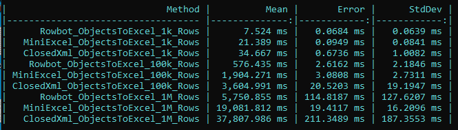

# What is Rowbot?
A fast non-garbage-allocating helper, that will take any source combined with any target and execute a transfer with a space complexity of O(1) meaning the use of memory will not rise when working with bigger amounts of data.

# Why use Rowbot?
- Rowbot has the fastest dotnet Excel writer on the market
- Extremely low memory consumption
- Can output csv and excel directly to asp.net OutputStream (both Framework and new dotnet)
- Modular composition - combine any existing source with any existing target - or even create you own source/target
- All csv work is based on the proven CsvHelper.

# Installation
```
dotnet add package Rowbot
```

# Examples
### Example: Objects => Excel
``` csharp
// Sync version
new RowbotExecutorBuilder()
    .FromObjects(myObjects)
    .ToExcel(filepath: "c:\\temp\\result.xlsx", sheetName: "Sheet1", writeHeaders: true)
    .Execute();

// Async version
await new RowbotAsyncExecutorBuilder()
     .FromObjects(myObjects)
     .ToExcel(filepath: "c:\\temp\\result.xlsx", sheetName: "Sheet1", writeHeaders: true)
     .ExecuteAsync();
```

### Benchmarks


[Benchmark source code](https://github.com/StephanMoeller/Rowbot/blob/main/benchmarks/Benchmarks.Excel/Program.cs)

### Example: Objects => Csv (Memory space complexity: O(1))
``` csharp
// Sync version
new RowbotExecutorBuilder()
    .FromObjects(myObjects)
    .ToCsvUsingCsvHelper(filepath: "c:\\temp\\output.csv", config: new CsvConfiguration(CultureInfo.InvariantCulture), writeHeaders: true)
    .Execute();
    
 // Async version
await new RowbotAsyncExecutorBuilder()
    .FromObjects(myObjects)
    .ToCsvUsingCsvHelper(filepath: "c:\\temp\\output.csv", config: new CsvConfiguration(CultureInfo.InvariantCulture), writeHeaders: true)
    .ExecuteAsync();
```

### Example: DataTable => Excel (Space complexity: O(1))
``` csharp
// Sync version
new RowbotExecutorBuilder()
    .FromObjects(myObjects)
    .ToExcel(filepath: "c:\\temp\\output.xlsx", sheetName: "MySheet", writeHeaders: true)
    .Execute();
            
// Async version
await new RowbotAsyncExecutorBuilder()
    .FromObjects(myObjects)
    .ToExcel(filepath: "c:\\temp\\output.xlsx", sheetName: "MySheet", writeHeaders: true)
    .ExecuteAsync();
```

### Example: DataTable => Csv (Space complexity: O(1))
``` csharp
// Sync version
new RowbotExecutorBuilder()
    .FromDataTable(myDataTable)
    .ToCsvUsingCsvHelper(filepath: "c:\\temp\\output.csv", config: new CsvConfiguration(CultureInfo.InvariantCulture), writeHeaders: true)
    .Execute();
            
// Async version
await new RowbotAsyncExecutorBuilder()
    .FromDataTable(myDataTable)
    .ToCsvUsingCsvHelper(filepath: "c:\\temp\\output.csv", config: new CsvConfiguration(CultureInfo.InvariantCulture), writeHeaders: true)
    .ExecuteAsync();
```

### Example: Database => Excel (Space complexity: O(1))
``` csharp
// Sync version
using Dapper;
using (var conn = new SqlConnection(myConnectionString))
{
    conn.Open();
    var dataReader = conn.ExecuteReader("SELECT * FROM Orders WHERE CustomerId = @customerId", new { customerId = 123 });

    new RowbotExecutorBuilder()
        .FromDataReader(dataReader)
        .ToExcel(filepath: "c:\\temp\\output.xlsx", sheetName: "MySheet", writeHeaders: true)
        .Execute();
}

// Async version
using Dapper;
using (var conn = new SqlConnection(myConnectionString))
{
    await conn.OpenAsync();
    var dataReader = conn.ExecuteReader("SELECT * FROM Orders WHERE CustomerId = @customerId", new { customerId = 123 });
            
    await new RowbotAsyncExecutorBuilder()
        .FromDataReader(dataReader)
        .ToExcel(filepath: "c:\\temp\\output.xlsx", sheetName: "MySheet", writeHeaders: true)
        .ExecuteAsync();
}

```

### Example: Database => Csv (Space complexity: O(1))
``` csharp

// Sync version
using Dapper;
using (var conn = new SqlConnection(myConnectionString))
{
    conn.Open();
    var dataReader = conn.ExecuteReader("SELECT * FROM Orders WHERE CustomerId = @customerId", new { customerId = 123 });

    new RowbotExecutorBuilder()
        .FromDataReader(dataReader)
        .ToCsvUsingCsvHelper(filepath: "c:\\temp\\output.csv", config: new CsvConfiguration(CultureInfo.InvariantCulture), writeHeaders: true)
        .Execute();
}
            
// Async version 
using Dapper;
using (var conn = new SqlConnection(myConnectionString))
{
    await conn.OpenAsync();
    var dataReader = conn.ExecuteReader("SELECT * FROM Orders WHERE CustomerId = @customerId", new { customerId = 123 });

    await new RowbotAsyncExecutorBuilder()
        .FromDataReader(dataReader)
        .ToCsvUsingCsvHelper(filepath: "c:\\temp\\output.csv", config: new CsvConfiguration(CultureInfo.InvariantCulture), writeHeaders: true)
        .ExecuteAsync();
}

```

### Example: DataTable => List of objects (Space complexity: O(1))
``` csharp
// Sync version
new RowbotExecutorBuilder()
    .FromDataTable(myDataTable)
    .ToObjects<Customer>()
    .Execute(objects =>
    {
        // NOTE: objects is not allocated in memory but streamed, allowing memory space complexity of O(1)
        // It is NOT possible to iterate this more than once.
        foreach (var customer in objects)
        {
            // Do something with the customer here
        }
    });
    

// Async version
await new RowbotAsyncExecutorBuilder()
    .FromDataTable(myDataTable)
    .ToObjects<Customer>()
    .ExecuteAsync(async objects =>
    {
        // NOTE: objects is not allocated in memory but streamed, allowing memory space complexity of O(1)
        // It is NOT possible to iterate this more than once.
        await foreach (var customer in objects)
        {
            // Do something with the customer here
        }
});
```

### Example: Csv => Excel (Space complexity: O(1))
``` csharp
new RowbotExecutorBuilder()
    .FromCsvByCsvHelper(inputStream: File.Open("path//to//file.csv", FileMode.Open), csvConfiguration: new CsvConfiguration(CultureInfo.InvariantCulture), readFirstLineAsHeaders: true)
    .ToExcel(filepath: "c:\\temp\\output.xlsx", sheetName: "MySheet", writeHeaders: true)
    .Execute();
    
// Async version
await new RowbotAsyncExecutorBuilder()
    .FromCsvByCsvHelper(inputStream: File.Open("path//to//file.csv", FileMode.Open), csvConfiguration: new CsvConfiguration(CultureInfo.InvariantCulture), readFirstLineAsHeaders: true)
    .ToExcel(filepath: "c:\\temp\\output.xlsx", sheetName: "MySheet", writeHeaders: true)
    .ExecuteAsync();
```


# Notes

- Design decision: Seperating source, execution and target
    - Easy plug and play any source with any target
    - Exponential growth of integration possibilites when adding sources. (e.g. When creating a new source, one automatically gets N new integrations where N is the number of available targets. And vice versa, when creating a new target, one automatically gets M new integrations where M is the number of available sources.)
    - Possible to benchmark a seperate source or target or the execution itself.
    - Less code to grasp at once, making it easier to understand, improve and test. E.g. you can look at one element, say a DataReaderSource, in isolation and all improvements to this will be beneficial to everyone using this source no matter what executor and/or target they combine it with.

- Todos
    - Fix problem with Exceltarget always closing stream
    - Stats for execution (Wait times per source + entry counts processed)
    - CancellationToken in ReadRow and WriteRow?
    - Add a test with Sqlite loading data and processing it to excel as a real life usage case test
    - Exceltarget: Test with reuse of array instead of creating new params-arrays over and over
